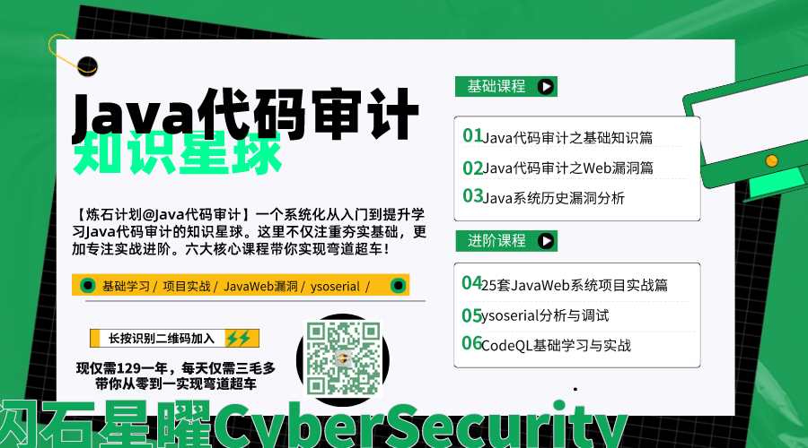

此处整理的是【炼石计划@Java代码审计】知识星球课程目录。

【炼石计划@Java代码审计】专注Java代码审计入门与提升。

在2022年6月中，我将知识星球分享做了重构，现将学习路线分成了六个阶段也对应着六大套课程分享。原文：https://t.zsxq.com/03myrJEQv

课程内容不深入开发细节，只关注Java代码审计应学应会的地方。

“目录内容只增不减，创作分享正按部就班进行中，会根据实际情况随时作出调整。”

欢迎大家微信搜索关注公众号【闪石星曜CyberSecurity】

欢迎维系扫描下方二维码加入【炼石计划@Java代码审计】

## 【第一阶段】：Java代码审计之基础知识篇

本阶段所有小节作业均可提交到以下链接：https://t.zsxq.com/03V7ufmMz

对于Java代码基础语法，需要大家私下进行补充学习。在这个阶段，我们主要学习在JAVA代码审计中所需的一些基础概念，基础知识。

主要学习以下内容。

- 1.1 Java基础环境搭建
  - 1.1.1 Java基础环境搭建之Ubuntu(https://t.zsxq.com/03ZBiaUFq)
  - 1.1.2 Java基础环境搭建之Windows(https://t.zsxq.com/03ZBiaUFq)
- 1.2 JavaWeb基础
  - 1.2.1 Servlet以及过滤器、监听器和拦截器(https://t.zsxq.com/03muVbqvf)
  - 1.2.2 JSP基础(https://t.zsxq.com/037M7AIie)
  - 1.2.3 Spring和SpringMVC(https://t.zsxq.com/03faUj2f6)
  - 1.2.4 SpringBoot和SpringCloud(https://t.zsxq.com/03ImYRJmE)
- 1.3 Java文件操作之文件上传(https://t.zsxq.com/04JUfm23f)
- 1.4 Java文件操作之文件读取与下载(https://t.zsxq.com/04iYRRnmY)
- 1.5 Java命令执行(https://t.zsxq.com/04UJIqJUN)
- 1.6 Java数据库操作(https://t.zsxq.com/04IaYVZby)
- 1.7 Java反射(https://t.zsxq.com/05yN3JM3f)
- 1.8 Java序列化与反序列化(https://t.zsxq.com/05n2bi23V)
- 1.9 RMI基础(https://t.zsxq.com/05ZV3BAmY)
- 1.10 JNDI基础(https://t.zsxq.com/06EaqNRfY)
- ......

## 【第二阶段】：Java代码审计之Web漏洞篇

本阶段主要讲述JavaWeb中常见的Web漏洞，辅以Java代码案例，以便更好的在JavaWeb系统中进行漏洞挖掘。

主要学习一下内容。

- SQL注入漏洞
- 文件上传漏洞
- 文件下载漏洞
- 命令执行漏洞
- 代码执行漏洞
- 反序列化漏洞
- SSRF
- XXE
- SSTI
- SPEL
- 内存马
- ......

## 【第三阶段】：Java代码审计之实战25套JavaWeb系统

虽然缩减成了了25套，也是为了将充足的精力匀给其他阶段，保证优质内容更好的产出。

本阶段将从开源JavaWeb系统出发，从实践中进行代码审计漏洞挖掘。

是提升Java代码审计能力不可或缺的一环。

1. 某RBAC管理系统

   【练习环境+教程文章】：https://t.zsxq.com/6aYR3rZ

   【提交作业】：https://t.zsxq.com/E2jeeIM

2. 某OA办公系统

   【练习环境】：https://t.zsxq.com/Y3rz3ju

   【教程文章】：https://t.zsxq.com/r376UJ6

   【提交作业】：https://t.zsxq.com/RnYbQrr

3. 迷你天猫商城

   【练习环境】：https://t.zsxq.com/NJaqFq3

   【课程文章】：https://t.zsxq.com/beEynAq

   【视频课程】：https://t.zsxq.com/66u3zny

   【提交作业】：https://t.zsxq.com/Vn23JMj

4. 货物管理系统

   【练习环境】：https://t.zsxq.com/JIQNVZn

   【教程文章】：https://t.zsxq.com/R7MVbey

   【提交作业】：https://t.zsxq.com/JmaUZZZ

5. 若依管理系统

   【教程文章】【完整版】：https://t.zsxq.com/znIQZNJ

6. 企业级通用报表平台

   【练习环境】：https://t.zsxq.com/nIYVnAE

   【教程文章】：https://t.zsxq.com/AyjmqVn

7. 任务调度系统

   【练习环境】：https://t.zsxq.com/j6YJujm

8. OFCMS

   【练习环境】：https://t.zsxq.com/Mfama2b

9. Jpress

   【练习环境】：https://t.zsxq.com/mEUfQBU

10. 新蜂商城

    【练习环境】：https://t.zsxq.com/yzbmEYz

11. 华夏ERP

    【练习环境】：https://t.zsxq.com/3FIaYJM

12. 未完待续......

## 【第四阶段】：Java代码审计之历史漏洞分析篇

本阶段主要代码审计分析复现基于Java开发的系统或组件的历史漏洞。

有些内容都被其他大佬讲烂了，但我还是会从我的角度进行详细的代码审计分析，手把手讲解系列。

有些内容虽然有很多大佬写过但还是有很多坑，我会将这些坑详细写出来。

当然这个阶段会有对外借鉴的部分，我也引出来源，以便大家全方面学习。

## 【第五阶段】：ysoserial调用链代码审计分析和调试篇

为了提升Java反序列化漏洞利用能力，我们从ysoserial下手，剖析调试ysoserial中每一个调用链。

- URLDNS
- Commons Collections 1
- Commons Collections 2
- Commons Beanutils
- Spring2
- Hibernate2
- Groovy1
- FileUpload1
- MozillaRhino2
- Myfaces2
- ROME1
- BeanShell1
- C3P0
- JBossInterceptors
- 不止上面这些

## 【第六阶段】：CodeQL基础学习与实战

这个阶段我也是现学现卖，我会讲我的学习感悟分享出来，以及期间遇到优秀的学习资源。

基于此，我们一起开拓一篇CodeQL带来的自动化代码审计疆域。

（具体分享目录大纲还在整理中）
